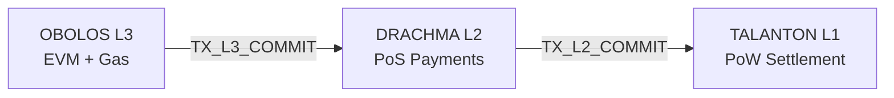

# PantheonChain


PantheonChain is a modular three-layer blockchain architecture designed to separate settlement security, high-throughput payments, and smart-contract execution into distinct layers with explicit anchoring guarantees.

## Executive Overview

PantheonChain is organized as:

- **TALANTON (L1)** — SHA-256d Proof-of-Work settlement and security anchor.
- **DRACHMA (L2)** — Proof-of-Stake + BFT payments and liquidity network.
- **OBOLOS (L3)** — Proof-of-Stake + BFT EVM execution environment.

Canonical anchoring path:

`OBOLOS -> DRACHMA -> TALANTON`

This design keeps L1 minimal and immutable, while L2 and L3 provide throughput and execution features with periodic commitment anchoring.

---

## Layer Anchoring Diagram



## Layer Responsibilities

### TALANTON (Layer-1)
- Consensus: **PoW (SHA-256d)**
- Role: Final settlement and root of trust
- Native token utility: Mining rewards and L1 fees only
- Commitment support: Accepts `TX_L2_COMMIT` from DRACHMA
- Explicitly does **not** include staking

### DRACHMA (Layer-2)
- Consensus: **Epoch-based PoS with BFT finality (>=2/3 active stake signatures)**
- Role: Payments, liquidity, low fees, high throughput
- Native token utility: Staking and L2 fees
- Commitment support:
  - Accepts `TX_L3_COMMIT` from OBOLOS
  - Publishes `TX_L2_COMMIT` to TALANTON

### OBOLOS (Layer-3)
- Consensus: **Epoch-based PoS with BFT finality (>=2/3 active stake signatures)**
- Role: Full EVM execution + gas accounting
- Native token utility: Gas and staking
- Commitment support: Publishes finalized commitments to DRACHMA

---


## Ancient Greek Monetary Model (Unit-of-Account)

PantheonChain enforces a protocol-level denomination model across TALANTON/DRACHMA/OBOLOS.

- **1 DRACHMA = 6 OBOLOS**
- **1 TALANTON = 6,000 DRACHMA = 36,000 OBOLOS**

This is strictly an accounting and denomination rule for base units, display units, fee quoting, and reporting.
It is **not** a fiat peg and **not** a promise of market price.

Canonical precision:

- TALANTON smallest unit: **talantonion** (`10^-8`)
- DRACHMA smallest unit: **drachmion** (`10^-8`)
- OBOLOS smallest unit: **obolion** (`10^-8`)

All internal ledger amounts remain integer base units; floating point is never used for consensus/accounting.

Historically, this follows the classical Attic denomination relationship where the drachma and obol were nested units of account.

---

## Repository Layout

- `src/common/` — shared networking, crypto, serialization, storage, mempool, commitments, metrics
- `src/talanton/` — TALANTON L1 commitment validation and anchor logic
- `src/drachma/` — DRACHMA PoS, staking/slashing, payments state machine, L3 commitment handling
- `src/obolos/` — OBOLOS PoS, EVM execution, gas accounting
- `src/relayers/` — commitment relay services (`l3->l2`, `l2->l1`)
- `src/tools/` — `pantheon-node` and `pantheon-cli`
- `tests/` — unit, integration, and fuzz coverage
- `configs/` — devnet/testnet/mainnet configuration

---

## Build and Run

### Local devnet

```bash
./scripts/build.sh
./scripts/run-devnet.sh
./scripts/test.sh
```

### Docker

```bash
docker compose up --build
```

### Testnet smoke

```bash
./scripts/build.sh
./scripts/run-testnet.sh
./tests/integration/testnet-smoke.sh
```

---

## Runtime Interfaces

### Node

```bash
parthenond /configs/l1.conf --layer=l1
parthenond /configs/l2.conf --layer=l2
parthenond /configs/l3.conf --layer=l3
```

### CLI

```bash
pantheon-cli stake deposit --layer=l2
pantheon-cli deploy-contract --layer=l3
pantheon-cli submit-commitment --layer=l2|l3
# send 2 tetradrachm (DRACHMA accounting)
pantheon-cli sendtoaddress DRACHMA <addr> 2 tetradrachm --in-dr
# stake-like DR amount entry in mina display units
pantheon-cli sendtoaddress DRACHMA <addr> 5 --denom=mina --in-dr
```

### RPC namespaces

- `/chain/info`
- `/staking/*`
- `/commitments/*`
- `/evm/*` (OBOLOS only)

---

## Genesis and Economics

Layer-specific genesis files:

- `genesis_talanton.json`
- `genesis_drachma.json`
- `genesis_obolos.json`

Each includes inflation schedules, epoch lengths, minimum stake, slashing ratios, and commitment intervals.

---

## Security Model (MVP)

PantheonChain currently uses rollup-style commitments without zk proofs or fraud proofs.

- TALANTON provides PoW settlement immutability.
- DRACHMA and OBOLOS provide fast BFT finality under honest-majority stake assumptions.
- Relayers provide commitment publication liveness.
- Bridge withdrawals are optimistic and use a documented trust window.

See `docs/threat-model.md` for explicit trust assumptions and risks.

---

## Documentation

- [Architecture](docs/architecture.md)
- [Consensus](docs/consensus.md)
- [Threat Model](docs/threat-model.md)
- [Migration](docs/migration.md)
- [Build](docs/build.md)
- [Run Devnet](docs/run-devnet.md)
- [RPC](docs/rpc.md)
- [CLI](docs/cli.md)
- [Denominations](docs/denominations.md)
- [Tokenomics](docs/tokenomics.md)
- [Operations](docs/operations.md)
- [Release](docs/release.md)
- [Glossary](docs/glossary.md)

---

## Contributing

See [CONTRIBUTING.md](CONTRIBUTING.md).
