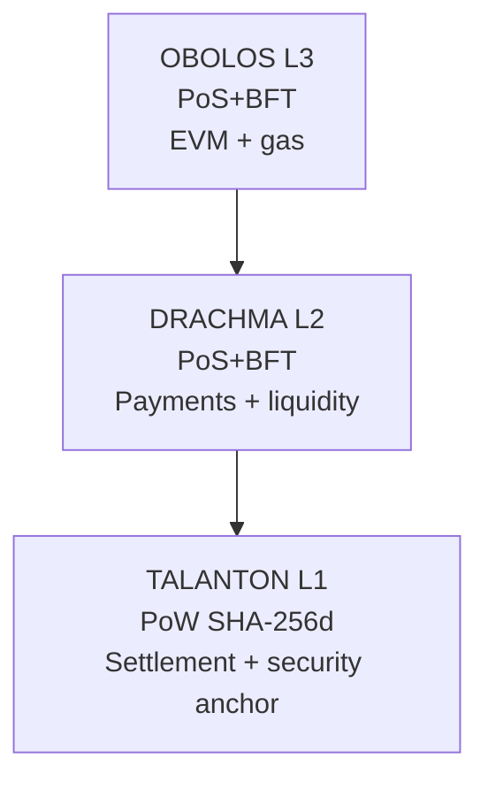

# Architecture

PantheonChain is a layered modular blockchain stack.

## Responsibilities

- **TALANTON (L1):** PoW consensus, settlement, immutable root of trust.
- **DRACHMA (L2):** high-throughput payments, staking/slashing, L3 commitment aggregation.
- **OBOLOS (L3):** contract execution and gas accounting.

## Anchoring path

`OBOLOS -> DRACHMA -> TALANTON`

## Source layout

- `src/common`: shared commitment/model utilities.
- `src/talanton`: L1 anchoring validation.
- `src/drachma`: PoS payments-layer helpers.
- `src/obolos`: execution-layer helpers.
- `src/relayers`: relayer binaries.
