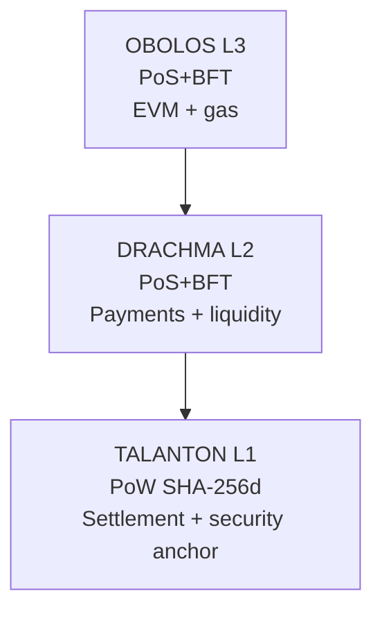

# Architecture

PantheonChain is a layered modular blockchain stack.

## Responsibilities

- **TALANTON (L1):** PoW consensus, settlement, immutable root of trust.
- **DRACHMA (L2):** high-throughput payments, staking/slashing, L3 commitment aggregation.
- **OBOLOS (L3):** contract execution and gas accounting.

## Anchoring path

`OBOLOS -> DRACHMA -> TALANTON`

## Source layout

- `src/common`: shared commitment/model utilities.
- `src/talanton`: L1 anchoring validation.
- `src/drachma`: PoS payments-layer helpers.
- `src/obolos`: execution-layer helpers.
- `src/relayers`: relayer binaries.
# PantheonChain Layered Architecture

PantheonChain is organized as a modular layered system:

- **TALANTON (L1 / PoW / SHA-256d):** settlement and security anchor.
- **DRACHMA (L2 / PoS+BFT):** payments and liquidity.
- **OBOLOS (L3 / PoS+BFT):** EVM execution and gas.

## Canonical anchoring path

`OBOLOS -> DRACHMA -> TALANTON`

OBOLOS finality commitments are included in DRACHMA, and DRACHMA commitments are included in TALANTON.

## Code layout

- `src/common`: shared primitives (commitments and validation helpers).
- `src/talanton`: L1 commitment validation for `TX_L2_COMMIT`.
- `src/drachma`: PoS proposer/validator logic and `TX_L3_COMMIT` validation.
- `src/obolos`: EVM-like execution and gas accounting primitives.
- `relayers/`: commitment relay binaries (`pantheon-relayer-l2`, `pantheon-relayer-l3`).

## Node operation modes

`pantheon-node --layer=l1|l2|l3`

Mining is restricted to `--layer=l1`.
