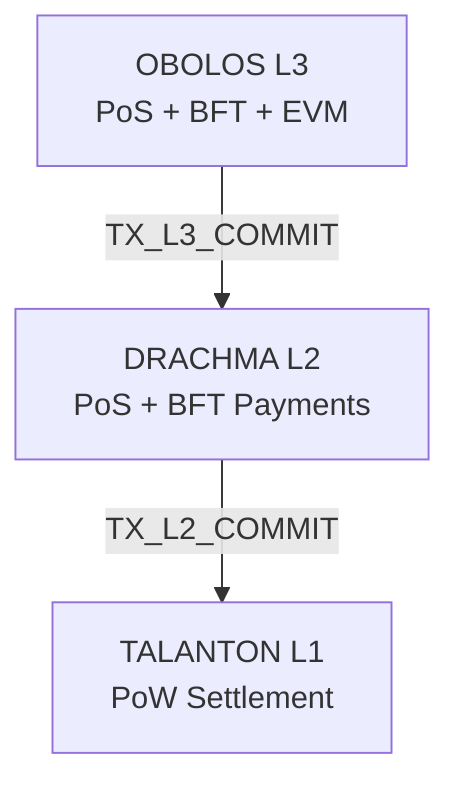

# PantheonChain Layered Architecture

PantheonChain is a modular three-layer blockchain stack with strict separation of responsibilities:

- **TALANTON (L1):** PoW settlement and security anchor.
- **DRACHMA (L2):** PoS payments and liquidity layer.
- **OBOLOS (L3):** PoS smart-contract execution layer with EVM and gas.

## Canonical Anchoring Path

`OBOLOS -> DRACHMA -> TALANTON`

OBOLOS finality commitments are first included in DRACHMA as `TX_L3_COMMIT`. DRACHMA then publishes `TX_L2_COMMIT` to TALANTON, carrying DRACHMA finalized state and the latest OBOLOS anchor reference via `upstream_commitment_hash`.

## Layer Responsibilities

## TALANTON (L1)

- Consensus: SHA-256d Proof-of-Work.
- Function: immutable settlement and trust root.
- Token: TALANTON for L1 fees + mining rewards.
- Excludes staking.
- Verifies `TX_L2_COMMIT` for monotonicity, payload encoding, and >=2/3 stake signatures from DRACHMA's active validator set.

## DRACHMA (L2)

- Consensus: epoch-based PoS with BFT finality.
- Function: payments, liquidity, high-throughput transfers.
- Token: DRACHMA for fees + staking rewards + validator staking.
- Maintains staking/slashing state and deterministic proposer selection.
- Verifies `TX_L3_COMMIT` from OBOLOS.
- Periodically commits finalized state to TALANTON.

## OBOLOS (L3)

- Consensus: epoch-based PoS with BFT finality.
- Function: EVM execution and gas accounting.
- Token: OBOLOS for gas + staking rewards + validator staking.
- Produces finalized commitments consumed by DRACHMA.

## Code Layout

- `src/common`: shared p2p, serialization, storage, mempool, metrics, cryptography, and commitment primitives.
- `src/talanton`: L1 commitment validation (`TX_L2_COMMIT`).
- `src/drachma`: L2 PoS logic, staking/slashing helpers, and `TX_L3_COMMIT` validation.
- `src/obolos`: L3 EVM execution and gas accounting helpers.
- `src/relayers/pantheon-relayer-l2.cpp`: DRACHMA -> TALANTON commitment relayer.
- `src/relayers/pantheon-relayer-l3.cpp`: OBOLOS -> DRACHMA commitment relayer.

## Runtime Modes

- Node mode: `pantheon-node --layer=l1|l2|l3`
- CLI examples:
  - `pantheon-cli stake deposit --layer=l2`
  - `pantheon-cli deploy-contract --layer=l3`
  - `pantheon-cli submit-commitment --layer=l2|l3`
