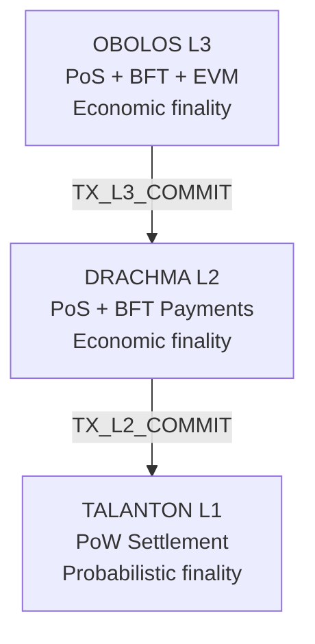

# PantheonChain Layered Architecture

PantheonChain is a hybrid three-layer blockchain stack with explicit security hierarchy:

- **TALANTON (L1):** PoW settlement and root trust layer.
- **DRACHMA (L2):** PoS/BFT payments and intermediate checkpoint layer.
- **OBOLOS (L3):** PoS/BFT EVM execution, governance, and DeFi layer.

## Canonical Checkpoint Path

`OBOLOS -> DRACHMA -> TALANTON`

```mermaid
flowchart TD
    L3[OBOLOS L3\nPoS + BFT + EVM\nEconomic finality] -->|TX_L3_COMMIT| L2[DRACHMA L2\nPoS + BFT Payments\nEconomic finality]
    L2 -->|TX_L2_COMMIT| L1[TALANTON L1\nPoW Settlement\nProbabilistic finality]
```

OBOLOS finality commitments are first included in DRACHMA as `TX_L3_COMMIT`. DRACHMA then publishes `TX_L2_COMMIT` to TALANTON, carrying DRACHMA finalized state and the latest OBOLOS anchor reference (`upstream_commitment_hash`).

## Layer Responsibilities

### TALANTON (L1)

- Consensus: SHA-256d PoW.
- Function: ultimate settlement and root trust for the system.
- Token role: TALANTON mining rewards + L1 fee/settlement unit.
- Validates `TX_L2_COMMIT` monotonicity, payload encoding, and DRACHMA validator quorum signatures.

### DRACHMA (L2)

- Consensus: PoS validator set with BFT-style quorum finality.
- Function: high-throughput payments and L2 state aggregation.
- Token role: DRACHMA staking collateral + L2 fee utility.
- Validates `TX_L3_COMMIT` from OBOLOS and checkpoints DRACHMA state to TALANTON.

### OBOLOS (L3)

- Consensus: PoS validator set with BFT-style quorum finality.
- Function: EVM execution, smart contracts, governance, and DeFi workloads.
- Token role: OBOLOS gas + staking + governance utility.
- Exports finalized L3 checkpoints to DRACHMA.

## Security Hierarchy

Settlement assurance order is:

`OBOLOS < DRACHMA < TALANTON`

Upper layers can deliver faster user-visible finality, but strongest settlement confidence is obtained only after TALANTON anchoring depth reaches the operator's required risk threshold.
